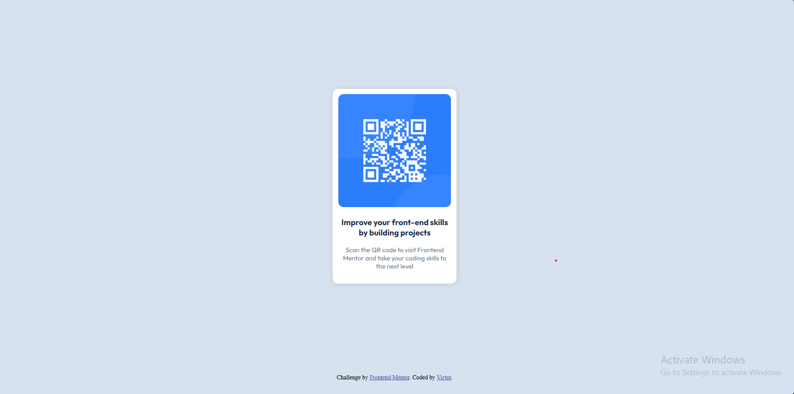

# Frontend Mentor - QR code component solution

This is a solution to the [QR code component challenge on Frontend Mentor](https://www.frontendmentor.io/challenges/qr-code-component-iux_sIO_H). Frontend Mentor challenges help you improve your coding skills by building realistic projects. 

## Table of contents

- [Overview](#overview)
  - [Screenshot](#screenshot)
  - [Links](#links)
- [My process](#my-process)
  - [Built with](#built-with)
  - [What I learned](#what-i-learned)
  - [Continued development](#continued-development)
- [Author](#author)

## Overview

### Screenshot

### Links

- Solution URL: https://github.com/vic1500/qr-code-component
- Live Site URL: https://qr-code-component-orpin.vercel.app/

## My process

### Built with

- Semantic HTML5 markup
- CSS custom properties
- Flexbox

### What I learned
Well I can't say I really learnt anything new as I already have a solid foundation and understanding of HTML and CSS and there wasn't really any difficulty in this project which my current knowledge couldn't really handle. Overall the project was fun to embark on as I was able to go back to test the foundation I already established in HTML and CSS.

### Continued development

Well one thing that I'd really love to do would be to increase my understanding of CSS Flexbox and Grid to better use them in my projects going forward.

## Author
- Frontend Mentor - [@vic1500](https://www.frontendmentor.io/profile/vic1500)
- LinkdIn - [Victor Arowosaye](https://www.linkedin.com/in/victor-arowosaye-a167b2303/)

